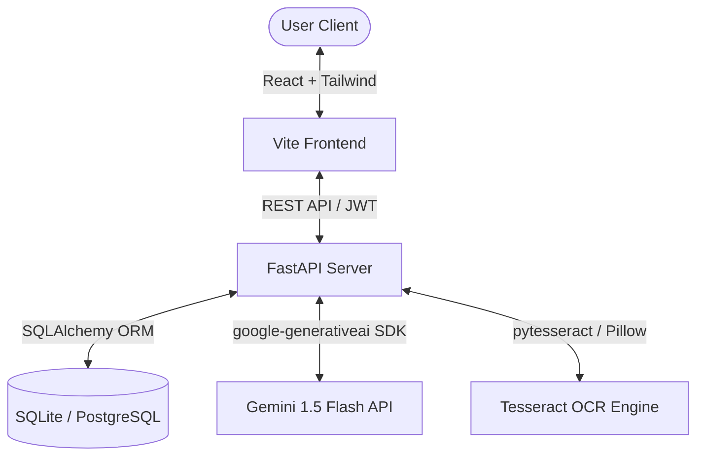
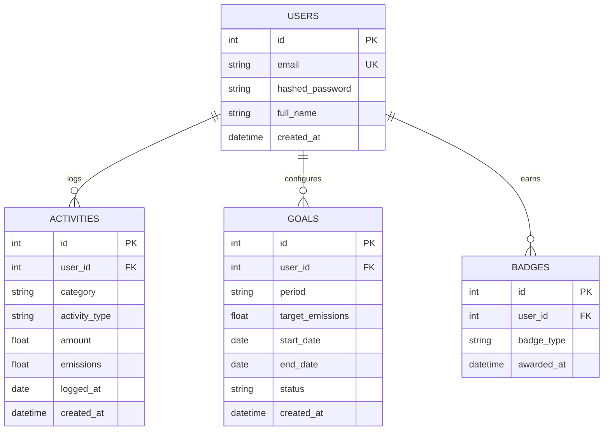
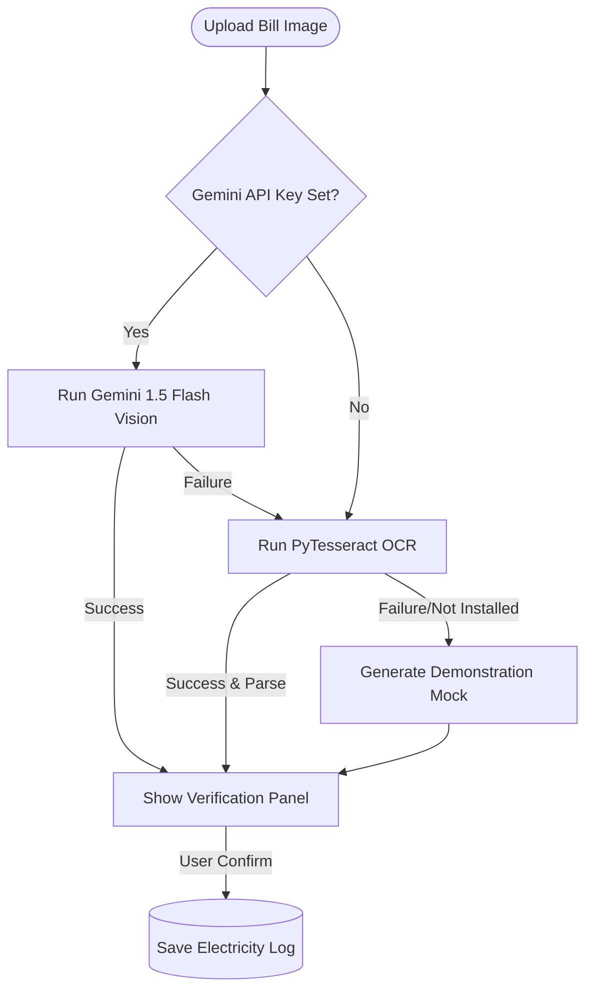

# System Architecture — EcoWise AI

This document provides a detailed breakdown of the technical design, data flows, and configuration systems of **EcoWise AI**.

---

## 1. Architectural Overview

EcoWise AI is designed as a decoupled full-stack application using a client-server architecture:

### Request Lifecycle
1. **Authentication**: The client sends credentials to `/api/auth/login`. The backend signs a JWT access token and returns user details. The client stores the token in `localStorage` and appends it to subsequent request headers.
2. **Carbon Tracker**: The client logs an activity. The backend computes the carbon footprint dynamically using standard emission vectors and writes to the DB.
3. **Bill Scanner**: The client uploads an electricity bill. The backend parses it using Tesseract OCR or falls back to Gemini Multimodal Vision API, returns verified fields, and logs it.
4. **AI Coach**: The backend aggregates 30-day emissions history and forwards it to Gemini to get recommendations.
5. **Twin Simulator**: Calculates carbon changes locally based on input scenarios and returns Recharts comparison payloads.

---

## 2. Database Schema

The database uses a clean relational schema representing users, logs, and targets:

---

## 3. Carbon Calculation Formula & Intensity Coefficients

Emissions are computed dynamically in `app/utils/carbon_calculator.py` using standard global average emission factors:

$$\text{Emissions } (kg\ CO_2e) = \text{Amount} \times \text{Emission Factor}$$

### Intensity Coefficients (kg CO2e)

| Category | Activity Type | Unit | Coefficient | Notes / Sources |
| :--- | :--- | :--- | :--- | :--- |
| **Transportation** | Car | km | `0.20` | Standard combustion passenger car |
| | Bus | km | `0.05` | Average public transport coach |
| | Train | km | `0.04` | Electric/diesel commuter rail |
| | Metro | km | `0.03` | Electric high-capacity metro |
| | Flight | km | `0.15` | Short-medium haul passenger flight |
| | Bicycle | km | `0.00` | Zero-emissions travel |
| **Home Energy** | Electricity | kWh | `0.50` | Average grid carbon intensity |
| | LPG | kg | `1.60` | Liquefied petroleum gas combustion |
| | Solar | kWh | `-0.50` | Solar offset (offsets grid electricity) |
| **Food & Diet** | Vegan | meals | `0.50` | Pure plant-based diet |
| | Vegetarian | meals | `1.00` | Dairy/eggs included, no meat |
| | Non-vegetarian | meals | `3.00` | Beef/pork/chicken diet heavy |
| **Waste** | Recycled | kg | `0.10` | Low recycling emissions |
| | Non-recycled | kg | `1.50` | Landfill methane contribution |

---

## 4. OCR Bill Scanner Workflow

The electricity bill scanner implements a triple-layer parsing model to ensure maximum reliability:

- **Gemini Multimodal Fallback**: If Tesseract is not configured on the local system path, the FastAPI server utilizes the same Gemini key to parse the image as a document blob, extracting the text structures using generative intelligence.
- **Verification Panel**: The user is always presented with the parsed results (kWh units, start date, end date) in an interactive UI overlay, allowing corrections before making database records.
